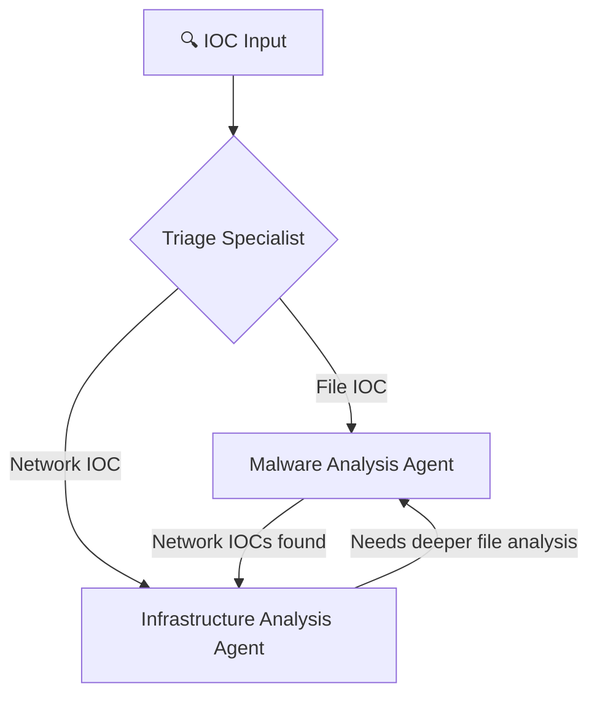

> disclaimer - used Gemini to create the readme

# AI Threat Hunter

AI Threat Hunter is a Python-based application that automates the investigation of cybersecurity Indicators of Compromise (IOCs). It uses the `crewai` framework to create a multi-agent system that mimics the workflow of a Security Operations Center (SOC).

## How it Works

The application takes an IOC (like a file hash, URL, or IP address) and kicks off an investigation. A crew of AI agents work together to analyze the IOC, gather threat intelligence, and produce a report with their findings.

The primary agents are:
- **Triage Specialist**: Performs the initial analysis of the IOC to determine its nature and threat level.
- **Malware Analysis Specialist**: Conducts a deep-dive behavioral analysis of file-based IOCs to understand their capabilities.

The agents use tools to interact with threat intelligence sources like Google Threat Intelligence (GTI) to enrich their analysis. The workflow is defined in configuration files, allowing for easy customization.

## Features

- **Automated IOC Analysis**: Streamlines the investigation of file hashes, URLs, domains, and IP addresses.
- **AI Agent Crew**: Utilizes a team of specialized AI agents for a comprehensive investigation.
- **Threat Intelligence Integration**: Connects to external threat intelligence APIs to gather evidence.
- **Configurable Workflow**: Agent roles and tasks are defined in YAML files for easy customization.
- **Selectable Backends**: Can be configured to use direct API calls or a more advanced MCP (Mission Control Platform) server.

## Planned Workflow

### 🔄 **Dynamic Agent Collaboration**



## Installation

1.  **Clone the repository:**
    ```bash
    git clone https://github.com/your-username/ai_threathunter.git
    cd ai_threathunter
    ```

2.  **Create a virtual environment and activate it:**
    ```bash
    python -m venv venv
    source venv/bin/activate  # On Windows use `venv\Scripts\activate`
    ```

3.  **Install the dependencies:**
    ```bash
    pip install -r requirements.txt
    ```

4.  **Set up your environment variables:**
    - Create a `.env` file by copying the `.env.example` file.
    - Add your API keys for the services you want to use (e.g., `GTI_API_KEY`).

## Usage

You can run an investigation from the command line.

### Standard Mode

To run a standard investigation, use the `ai_threathunter.py` script:

```bash
python ai_threathunter.py investigate <IOC>
```
You will be prompted to enter an IOC.

### Debug Mode

For more verbose output, you can use the `run_debug.py` script. This is helpful for development and troubleshooting.

```bash
python run_debug.py <IOC_TO_INVESTIGATE>
```
If you don't provide an IOC on the command line, you will be prompted to enter one.

## Project Structure

```
ai_threathunter/
├── reports/                  # Output reports from investigations
├── src/
│   └── ai_threathunter/
│       ├── config/           # Agent and task configuration files
│       │   ├── agents.yaml
│       │   └── tasks.yaml
│       ├── tools/            # Tools used by the AI agents
│       ├── crew.py           # Defines the crew of AI agents
│       └── main.py           # Main application logic
├── .env.example              # Example environment variables file
├── ai_threathunter.py        # Main entry point for the application
├── run_debug.py              # Runner script for debug mode
└── requirements.txt          # Python dependencies
```

## Roadmap

### Agents
- [] Infra Analysis Agent - Investigates network indicators
- [] Threat Hunter Agent - Correlates and provide hunt hypothesis for continued hunts
- [] Orchestrator Agent - Acts as the correlation from all the output and provides the final verdict

### Tools
- [] MCP servers for agents to use 
- [] Shodan for Infra Hunter Agent
