> disclaimer - used Gemini to create the readme

# AI Threat Hunter

AI Threat Hunter is a Python-based application that automates the investigation of cybersecurity Indicators of Compromise (IOCs). It uses the `crewai` framework to create a multi-agent system that mimics the workflow of a Security Operations Center (SOC).

## How it Works

The application takes an IOC (like a file hash, URL, or IP address) and kicks off an investigation. A crew of AI agents work together to analyze the IOC, gather threat intelligence, and produce a report with their findings.

The primary agents are:
- **Triage Specialist**: Performs the initial analysis of the IOC to determine its nature and threat level.
- **Malware Analysis Specialist**: Conducts a deep-dive behavioral analysis of file-based IOCs to understand their capabilities.
- **Infrastructure Analysis Specialist**: Maps out adversary infrastructure and finds connections between different network IOCs such as IP addresses and domains.

The agents use tools to interact with threat intelligence sources like Google Threat Intelligence (GTI) to enrich their analysis. The workflow is defined in configuration files, allowing for easy customization.

## Features

- **Automated IOC Analysis**: Streamlines the investigation of file hashes, URLs, domains, and IP addresses.
- **AI Agent Crew**: Utilizes a team of specialized AI agents for a comprehensive investigation, covering triage, malware analysis, and infrastructure mapping.
- **Threat Intelligence Integration**: Connects to external threat intelligence APIs to gather evidence.
- **Configurable Workflow**: Agent roles and tasks are defined in YAML files for easy customization.
- **Selectable Backends**: Can be configured to use direct API calls or a more advanced MCP (Mission Control Platform) server.

## Planned Workflow

The current workflow is **sequential**:

```mermaid
graph TD
    A[🔍 IOC Input] --> B(Triage Specialist);
    B --> C(Malware Analysis Agent);
    C --> D(Infrastructure Analysis Agent);
```


A dynamic, orchestrated workflow is planned for a future release.

## Installation

1.  **Clone the repository:**
    ```bash
    git clone https://github.com/your-username/ai_threathunter.git
    cd ai_threathunter
    ```

2.  **Create a virtual environment and activate it:**
    ```bash
    python3 -m venv venv
    source venv/bin/activate  # On Windows use `venv\Scripts\activate`
    ```

3.  **Install the dependencies:**
    ```bash
    pip install -r requirements.txt
    ```

4.  **Set up your environment variables:**
    - Create a `.env` file by copying the `.env.example` file.
    - Add your `GTI_API_KEY` for Google Threat Intelligence.
    - **Configure the agent backend**: Set `USE_GTI_MCP=true` to use the MCP server backend for specialist agents, or `false` to use direct API calls.

## Usage

The application is controlled via a command-line interface.

### Run a Single Investigation

To investigate a single IOC, use the `investigate` command:
```bash
python3 ai_threathunter.py investigate {IOC}
```
*Example:*
```bash
python3 ai_threathunter.py investigate celebratioopz.shop
```

### Enable Debug Mode

For more verbose output and to save detailed logs of all API calls, update the DEBUG_API_CALLS environment variable to TRUE:
```bash
export DEBUG_API_CALLS=TRUE
```

## Project Structure

```
ai_threathunter/
├── reports/                  # Output reports from investigations
├── src/
│   └── ai_threathunter/
│       ├── config/           # Agent and task configuration files
│       │   ├── agents.yaml
│       │   └── tasks.yaml
│       ├── tools/            # Tools used by the AI agents
│       ├── crew.py           # Defines the crew of AI agents
│       └── main.py           # Main application logic
├── .env.example              # Example environment variables file
├── ai_threathunter.py        # Main entry point for the application
├── run_debug.py              # Runner script for debug mode
└── requirements.txt          # Python dependencies
```

## Roadmap

### Agents
- [x] Infra Analysis Agent - Investigates network indicators
- [ ] Threat Hunter Agent - Correlates and provide hunt hypothesis for continued hunts
- [ ] Orchestrator Agent - Acts as the correlation from all the output and provides the final verdict

### Tools
- [x] MCP servers for agents to use 
- [ ] Shodan for Infra Hunter Agent
- [ ] URLScan for Infra Hunter Agent
- [ ] Ghidra (or similar) for Malware analysis agent

### Final Workflow

```mermaid
graph TD
    A[🔍 IOC Input] --> B{Triage Specialist};
    B -- File IOC --> C[Malware Analysis Agent];
    B -- Network IOC --> D[Infrastructure Analysis Agent];
    C -- updates --> E[Orchestrator Agent]
    D -- updates --> E
    E -- Suspicious Network IOCs found --> D
    E -- Suspicious Files Found --> C
    E -- Informs --> F[Threat Hunter Agent]
```
