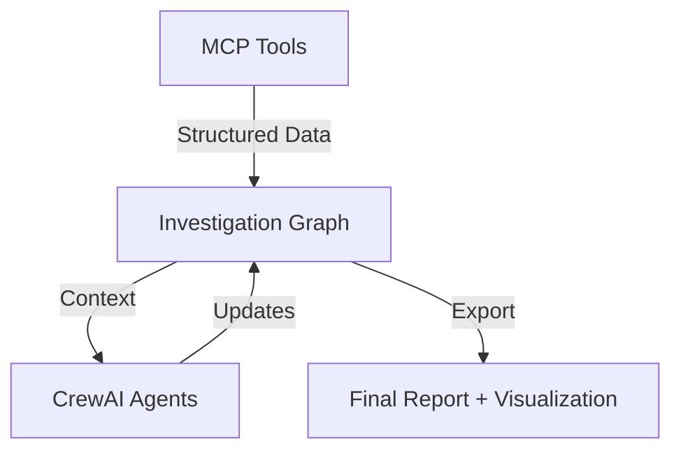

# Migration Log: V1 to V2 Architecture

## Overview
This document chronicles the successful migration of the **AI Threat Hunter** from a simple sequential script (Version 1) to a structured, orchestrated system (Version 2).

**Timeline**: Dec 14, 2025 - Dec 19, 2025

| Phase | Core Capability | Key Changes |
|-------|----------------|-------------|
| **V1** | Sequential Execution | Hardcoded flow, limited context passing, unstructured text outputs. |
| **V2** | Orchestration & Graph | Pydantic data models, persistent Investigation Graph, MCP integration, automated visualization. |

---

## 📅 Phase 1: Foundation & Data Structures
**Goal**: Move away from unstructured dictionaries and string passing.

### 1. Unified Data Models (`core/models.py`)
- **Action**: Defined Pydantic models to enforce strict typing across the entire system.
- **Key Models**:
  - `IOCAnalysisResult`: Standardized container for analysis outputs.
  - `GraphEdge`: Explicitly defined relationships between nodes.
  - `IOCType`, `RelationshipType`: Enums for consistency.

### 2. The Investigation Graph (`core/investigation_graph.py`)
- **Problem**: In V1, agents couldn't "remember" past findings unless explicitly passed in prompt text.
- **Solution**: Implemented an in-memory `NetworkX` graph.
- **Features**:
  - `add_analysis_result()`: Automatically builds graph from agent outputs.
  - `add_edge()` with duplication detection.
  - State persistence (JSON dump/load).

---

## 📅 Phase 2: Tooling & MCP Integration
**Goal**: Leverage the new Google Threat Intelligence (GTI) MCP Server.

### 1. MCP Tool Implementation (`tools/gti_mcp_tool.py`)
- **Action**: Replaced direct API calls with MCP (Model Context Protocol) interactions.
- **Enhancement**: 
  - Automatically parses raw JSON from GTI into `IOCAnalysisResult` objects.
  - Extracts rich relationships (e.g., "RESOLVES_TO") for the graph.

### 2. Cache Management (`utils/cache_manager.py`)
- **Action**: Implemented filesystem caching to reduce API costs and improve speed during development/debugging.
- **Optimization**: Added TTL (Time To Live) logic.

---

## 📅 Phase 3: Orchestration Logic
**Goal**: Enable dynamic decision making (foundation for V3).

### 1. The Orchestrator Agent
- **V1**: Just a summarizer at the end of the chain.
- **V2**: A central node with visibility into the full investigation state.
- **Tool**: Created `GraphInspectionTool` allowing the Orchestrator to query the state (e.g., "What hash nodes are unanalyzed?").

### 2. Agent Wiring (`crew.py`)
- **Action**: Updated all agents to share a single `InvestigationGraph` instance.
- **Outcome**: Findings from the Triage Agent are instantly available to the Infrastructure Agent via the shared graph.

---

## 📅 Phase 4: Visualization & Reporting
**Goal**: Make the "invisible" work visible to the user.

### 1. Automated Graph Visualization
- **Feature**: Implemented `to_mermaid()` in `InvestigationGraph`.
- **Logic**: Converts the NetworkX graph state into Mermaid.js markdown syntax.
- **Result**: Final report now includes a visual diagram of the attack infrastructure.

### 2. Descriptive Edges
- **Enhancement**: Added human-readable context to graph edges.
- **Before**: `Domain -> IP`
- **After**: `Domain -> IP` (Description: "Domain load.serverpit.com resolves to IP 210.16.120.35")

---

## 📅 Phase 5: Optimization & Refinement
**Goal**: Clean up technical debt before V3.

### 1. Duplicate Detection
- **Issue**: Agents finding the same link twice caused graph clutter.
- **Fix**: Added logic to `InvestigationGraph` to log and skip duplicate edges.

### 2. Code Deduplication
- **Issue**: Graph export logic matched in `main.py` and `crew.py`.
- **Fix**: Extracted shared helper `utils/report_utils.py`.

---

## Summary of V2 Architecture
The system now operates as a stateful, graph-centric application.

**Next Step**: Version 3 (Iterative Workflow) will leverage this graph foundation to enable dynamic looping and backtracking.
