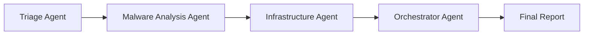
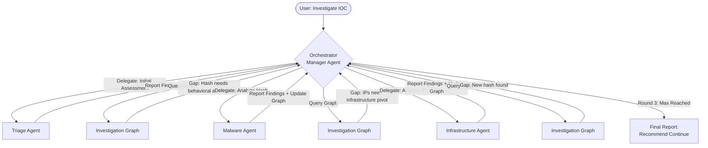

# Version 3: Iterative Investigation Workflow - Design Document

## Executive Summary

This document proposes **Version 3** of the AI Threat Hunter: transitioning from a **sequential, linear workflow** to an **iterative, orchestrator-driven investigation loop** using CrewAI's **Hierarchical Process**.

**Key Change**: The Orchestrator Agent becomes a **Manager** that dynamically delegates work to specialist agents based on findings from the Investigation Graph, enabling multi-round pivoting and deeper infrastructure correlation.

---

## 1. Current Architecture (V2) - Sequential Flow

### Workflow


### Limitations
1. **Fixed Path**: Every investigation follows the same sequence regardless of IOC type or findings.
2. **No Backtracking**: If Infrastructure Agent finds new hashes, they cannot be re-analyzed.
3. **Single Pass**: Each agent runs exactly once, missing opportunities for iterative deepening.
4. **Orchestrator is Reactive**: Only synthesizes existing data, doesn't drive new work.

---

## 2. Proposed Architecture (V3) - Hierarchical Process

### Workflow


### Key Principles
1. **Manager-Worker Pattern**: Orchestrator is the manager, specialist agents are workers.
2. **Graph-Driven Decisions**: Manager queries InvestigationGraph to identify what needs analysis.
3. **Dynamic Delegation**: Work is assigned based on findings, not a pre-determined sequence.
4. **Bounded Iteration**: Manager enforced to delegate max 3 rounds via prompt.

---

## 3. CrewAI Hierarchical Process Setup

### Code Structure

```python
from crewai import Agent, Crew, Process, Task

# In crew.py
class ThreatHuntingCrew:
    def __init__(self):
        self.investigation_graph = InvestigationGraph()
        
        # All tools share the same graph instance
        self.gti_tool = GTITool(investigation_graph=self.investigation_graph)
        self.gti_mcp_tool = GTIMCPTool(investigation_graph=self.investigation_graph)
        self.graph_inspection_tool = GraphInspectionTool(investigation_graph=self.investigation_graph)

    @agent
    def triage_specialist(self) -> Agent:
        """Worker: Performs initial IOC assessment"""
        return Agent(
            config=self.agents_config['triage_specialist'],
            tools=[self.gti_tool],
            allow_delegation=False  # Workers don't delegate
        )

    @agent
    def malware_specialist(self) -> Agent:
        """Worker: Deep behavioral analysis"""
        return Agent(
            config=self.agents_config['malware_analysis_specialist'],
            tools=[self.gti_mcp_tool],
            allow_delegation=False
        )

    @agent
    def infrastructure_hunter(self) -> Agent:
        """Worker: Infrastructure correlation"""
        return Agent(
            config=self.agents_config['infrastructure_analysis_specialist'],
            tools=[self.gti_infrastructure_tool],
            allow_delegation=False
        )

    @agent
    def orchestrator_manager(self) -> Agent:
        """Manager: Coordinates investigation via delegation"""
        return Agent(
            role="Investigation Coordinator and Manager",
            goal="Coordinate specialist agents to conduct a thorough investigation",
            backstory="""You are the lead investigator coordinating a team of 
            specialist threat intelligence analysts. You delegate work to your team 
            based on what the Investigation Graph reveals needs analysis.""",
            tools=[self.graph_inspection_tool],
            allow_delegation=True,  # Manager can delegate
            verbose=True
        )

    @task
    def iterative_investigation(self) -> Task:
        """High-level investigation task managed by orchestrator"""
        return Task(
            description="""
            Coordinate a thorough, iterative investigation of the IOC: {ioc}
            
            **Your Role as Investigation Manager**:
            You coordinate a team of 3 specialist agents to investigate threats.
            
            **Specialists Available to Delegate To**:
            - **Triage Specialist**: Initial assessment of any IOC type
            - **Malware Analysis Specialist**: Behavioral analysis of file hashes
            - **Infrastructure Specialist**: Network IOC correlation and pivoting
            
            **Your Investigation Process**:
            
            1. **Round 1 - Initial Assessment**:
               - Delegate the initial IOC to the Triage Specialist
               - Wait for their report
               - Use the Graph Inspection Tool to query the Investigation Graph
            
            2. **Round 2 - Deep Dive**:
               - Query the graph: "What nodes need analysis?"
               - If unanalyzed hashes exist → Delegate to Malware Specialist
               - If unanalyzed IPs/domains exist → Delegate to Infrastructure Specialist
               - Update graph state and re-assess
            
            3. **Round 3 - Final Pivots**:
               - Query graph again for remaining gaps
               - Delegate ONE more critical analysis
               - This is your FINAL delegation round
            
            4. **Synthesis**:
               - Query graph for complete picture
               - If gaps remain, explicitly state: "RECOMMEND: Continue Investigation"
               - List unanalyzed IOCs as follow-up actions
            
            **Critical Rules**:
            - Maximum 3 delegation rounds (excluding final synthesis)
            - Always use Graph Inspection Tool before delegating
            - Prioritize high-value IOCs (hashes with malicious votes, C2 IPs)
            - Update the Investigation Graph after each specialist reports back
            
            **Expected Output**: Complete investigation report with findings, 
            graph visualization, and continuation recommendations if applicable.
            """,
            agent=self.orchestrator_manager(),
            expected_output="Comprehensive investigation report with all findings and actionable recommendations",
            context=[]  # No context needed, manager drives from inputs
        )

    @crew
    def crew(self) -> Crew:
        """Creates the hierarchical investigation crew"""
        return Crew(
            agents=[
                self.triage_specialist(),
                self.malware_specialist(),
                self.infrastructure_hunter()
            ],
            tasks=[self.iterative_investigation()],
            process=Process.hierarchical,
            manager_agent=self.orchestrator_manager(),
            verbose=True,
            memory=False
        )
```

---

## 4. Manager Decision Logic (Prompt-Driven)

Unlike the custom loop approach, the manager's decisions are **LLM-driven** based on its prompt and tools. The manager will:

### Decision Pattern
```
1. Receive delegation report from worker
2. Call GraphInspectionTool.run(query_type='summary')
3. Analyze output:
   - Unanalyzed hashes? → Delegate to Malware Specialist
   - Unanalyzed IPs/Domains? → Delegate to Infrastructure Specialist
   - All analyzed? → Synthesize final report
4. Track round count internally (via prompt guidance)
5. Stop at round 3 even if gaps exist
```

### Example Manager Thought Process
```
Manager: "Worker Triage Specialist has completed initial assessment of hash ABC123. 
They found it communicates with C2 domain evil.com. Let me check the graph state."

[Calls GraphInspectionTool(query_type='summary')]

Manager: "Graph shows 1 file node, 1 domain node. The file node has behavioral 
analysis pending. This is Round 1. I should delegate ABC123 to Malware Specialist."

[Delegates to Malware Specialist]

Manager: "Malware Specialist reports hash ABC123 drops file init.dll and contacts 
IPs 1.2.3.4, 5.6.7.8. Graph updated. Let me check state again."

[Calls GraphInspectionTool(query_type='summary')]

Manager: "Graph shows 2 IPs without infrastructure analysis. This is Round 2. 
I should delegate these IPs to Infrastructure Specialist."

[Delegates to Infrastructure Specialist]

Manager: "Infrastructure Specialist reports IP 1.2.3.4 hosts 3 domains, one resolves 
to new hash XYZ789. This is Round 3 (max reached). I will note XYZ789 requires 
follow-up and synthesize final report."

[Creates final report with "RECOMMEND: Continue Investigation - Analyze hash XYZ789"]
```

---

## 5. InvestigationGraph Enhancements

To support the manager's decision-making, add these helper methods:

```python
class InvestigationGraph:
    def get_summary(self) -> Dict[str, Any]:
        """Enhanced summary with analysis status"""
        return {
            'total_nodes': self.graph.number_of_nodes(),
            'total_edges': self.graph.number_of_edges(),
            'nodes_by_type': self._count_nodes_by_type(),
            'unanalyzed_hashes': self._find_unanalyzed_nodes(IOCType.FILE),
            'unanalyzed_ips': self._find_unanalyzed_nodes(IOCType.IP),
            'unanalyzed_domains': self._find_unanalyzed_nodes(IOCType.DOMAIN)
        }
    
    def _find_unanalyzed_nodes(self, ioc_type: IOCType) -> List[str]:
        """Find nodes of given type without analysis data"""
        unanalyzed = []
        for node_id, attrs in self.graph.nodes(data=True):
            if attrs.get('type') == ioc_type:
                # Check if node has analysis result
                if not attrs.get('data'):
                    unanalyzed.append(node_id)
        return unanalyzed
    
    def mark_node_analyzed(self, node_id: str, analysis_type: str):
        """Mark a node as analyzed to prevent re-analysis"""
        if self.graph.has_node(node_id):
            self.graph.nodes[node_id][f'{analysis_type}_complete'] = True
```

### GraphInspectionTool Enhancement

```python
def _run(self, query_type: str, ioc: str = None) -> Dict[str, Any]:
    if query_type == "summary":
        summary = self._investigation_graph.get_summary()
        
        # Add human-readable analysis gaps
        gaps = []
        if summary['unanalyzed_hashes']:
            gaps.append(f"{len(summary['unanalyzed_hashes'])} hashes need behavioral analysis")
        if summary['unanalyzed_ips']:
            gaps.append(f"{len(summary['unanalyzed_ips'])} IPs need infrastructure analysis")
        
        summary['analysis_gaps'] = gaps
        return summary
    # ... rest of implementation
```

---

## 6. Advantages of Hierarchical Approach

### vs. Sequential (V2)
- ✅ Dynamic routing based on findings
- ✅ Multi-round pivoting (3 rounds vs 1)
- ✅ Intelligent gap detection

### vs. Custom Loop (Alternative)
- ✅ **Native CrewAI Support**: Leverages built-in manager-worker pattern
- ✅ **Less Code**: No manual orchestration loop needed
- ✅ **Better Logging**: CrewAI tracks all delegations automatically
- ✅ **Automatic Context**: Results flow between agents seamlessly
- ✅ **Prompt Flexibility**: Manager can handle edge cases we didn't code for
- ✅ **Maintainability**: Benefits from CrewAI framework updates

### Disadvantages (Trade-offs)
- ⚠️ **Less Predictable**: Manager decisions are LLM-based, not explicit code
- ⚠️ **Debugging Harder**: CrewAI internal logic vs our own code
- ⚠️ **Round Counting**: Relies on prompt adherence vs explicit counter

**Verdict**: Advantages outweigh disadvantages. Hierarchical is the right choice.

---

## 7. Stopping Conditions & Recommendations

### Stopping Logic (Prompt-Driven)
The manager's prompt explicitly states:
- "Maximum 3 delegation rounds"
- "If gaps remain after Round 3, recommend continuation"

### Recommendation Output Format
When max rounds reached with gaps:

```markdown
## Investigation Status: INCOMPLETE

The investigation reached the maximum iteration depth (3 rounds) with the 
following unanalyzed IOCs remaining:

**Unanalyzed Hashes**:
- `XYZ789` (found via infrastructure pivot, linked to C2 IP 1.2.3.4)

**Unanalyzed Network IOCs**:
- IP: `9.9.9.9` (new C2 server identified)

---

## RECOMMENDATION: Continue Investigation

**Priority Actions**:
1. Submit hash `XYZ789` for behavioral analysis (HIGH - linked to active C2)
2. Investigate IP `9.9.9.9` for hosting provider and SSL certificate analysis
3. Correlate findings with threat intelligence for campaign attribution

**Estimated Effort**: 2 additional investigation rounds
```

---

## 8. Migration Path from V2 to V3

### Phase 1: Manager Agent Setup (Week 1)
- [x] Create `orchestrator_manager` agent with delegation enabled
- [x] Write comprehensive manager prompt with round counting guidance
- [x] Add `GraphInspectionTool` enhancements (summary with gaps)

### Phase 2: Hierarchical Process (Week 2)
- [x] Update `crew()` to use `Process.hierarchical`
- [x] Set `manager_agent=orchestrator_manager()`
- [x] Remove sequential task dependencies (manager handles flow)
- [x] Test with sample investigation (verify max 3 rounds)

### Phase 3: Worker Agent Updates (Week 3)
- [x] Ensure all worker agents set `allow_delegation=False`
- [x] Update worker prompts to "report findings to manager"
- [x] Verify graph updates happen correctly after each delegation

### Phase 4: Validation & Refinement (Week 4)
- [x] Run regression tests on existing investigations
- [x] Compare V2 vs V3 outputs (depth and coverage)
- [x] Tune manager prompt based on observed behavior
- [x] Document new workflow in README

---

## 9. Success Metrics for V3

- **Depth**: Average number of delegation rounds (target: 2-3)
- **Coverage**: % increase in discovered IOCs vs V2 (target: +40%)
- **Actionability**: % of investigations with "Continue" recommendation (target: <30%)
- **Decision Quality**: Manager correctly identifies analysis gaps (target: >90%)
- **Efficiency**: No redundant delegations (same IOC analyzed twice)

---

## 10. Example Investigation Flow

Given IOC: Hash `ABC123`

### Round 1: Triage
```
Manager → Triage Specialist: "Assess hash ABC123"
Triage → Manager: "Malicious. LOGICBURST. C2: evil.com. UNC6492."
Manager queries graph → Sees unanalyzed hash ABC123
Manager → Malware Specialist: "Analyze hash ABC123 behaviorally"
```

### Round 2: Behavioral Analysis
```
Malware Specialist → Manager: "Drops init.dll, contacts 1.2.3.4:80, 5.6.7.8:443"
Graph updated with 2 IPs
Manager queries graph → Sees 2 unanalyzed IPs
Manager → Infrastructure Specialist: "Analyze IPs 1.2.3.4 and 5.6.7.8"
```

### Round 3: Infrastructure Pivot
```
Infrastructure Specialist → Manager: "1.2.3.4 hosts malicious2.com, 5.6.7.8 shares SSL cert with hash XYZ789"
Graph updated with new hash XYZ789
Manager queries graph → Sees unanalyzed hash XYZ789, but Round 3 (max)
Manager → Final Report: "RECOMMEND: Continue - Analyze XYZ789 (linked to known C2)"
```

---

## Conclusion

**Version 3 uses CrewAI's Hierarchical Process** to transform the linear investigation into a dynamic, manager-driven workflow. 

**Key Benefits**:
- **Native Framework Support**: Leverages CrewAI's built-in manager-worker pattern
- **Intelligent Pivoting**: Manager makes data-driven delegation decisions
- **Minimal Custom Code**: Framework handles orchestration complexity
- **Scalable**: Easy to add new specialist agents as workers

**Implementation Feasibility**: High. Straightforward refactor of existing V2 architecture.

**Recommendation**: Proceed with hierarchical implementation. Estimated 4-week development cycle.
