# Gemini Project Context: AI Threat Hunter

This document provides context on the AI Threat Hunter project for Gemini.

## Project Purpose

The AI Threat Hunter is a Python-based application that automates the investigation of cybersecurity Indicators of Compromise (IOCs). It leverages the `crewai` framework to create a multi-agent system that mimics the workflow of a Security Operations Center (SOC).

Key features include:
- **Automated IOC Analysis:** The system takes an IOC (like a file hash, URL, or IP address) and initiates an investigation.
- **AI Agent Crew:** A team of specialized AI agents collaborates on the investigation:
    - A **Triage Specialist** acts as the Tier 1 analyst, performing initial assessment using tools like Google Threat Intelligence (GTI).
    - Specialist agents, such as a **Malware Analysis Specialist**, act as the Tier 2 escalation point, performing deep-dive analysis of artifacts like malicious files.
- **Threat Intelligence Integration:** Agents use tools to query external threat intelligence APIs (GTI, URLScan) to gather evidence.
- **Configurable Workflow:** The behavior and roles of the agents, and the tasks they perform, are defined in YAML configuration files, allowing for flexible adaptation.
- **Selectable Backends:** The system is designed to switch between different data sources, such as a direct GTI API connection or a more advanced MCP (Mission Control Platform) server.

## 🤖 **AI Crew for Threat Hunting**

- **🔍 Triage Specialist** - Rapid IOC assessment and priority identification
- **🦠 Malware Analysis** - Deep behavioral analysis and attack chain reconstruction  
- **🕸️ Infrastructure Specialist** - Campaign correlation and infrastructure mapping

## Expected Workflow

### 🔄 **Dynamic Agent Collaboration**

```mermaid
graph TD
    A[🔍 IOC Input] --> B{Triage Specialist};
    B -- File IOC --> C[Malware Analysis Agent];
    B -- Network IOC --> D[Adversary Infrastructure Agent];
    C -- Network IOCs found --> D;
    D -- Needs deeper file analysis --> C;
```

## Expected Toolings for Agent

The system can run in two modes: Direct API mode or MCP Server mode.

- **Triage Specialist**
  - Direct API Mode: `gti_tool.py`
  - MCP Mode: `gti_mcp_tool.py` (action: `lookup_ioc`)

- **Malware Analysis Agent**
  - Direct API Mode: `gti_behaviour_analysis_tool.py`
  - MCP Mode: `gti_mcp_tool.py` (action: `get_behaviour_summary`)

- **Adversary Infrastructure Agent**
  - Shodan MCP Server: `shodan_mcp_tool.py` (Future)
  - AI Visual Detector: From `ai_phishing_detector` (Future)
  - *Note: This agent would also use the unified `gti_mcp_tool.py` for any GTI lookups.*

## Development Steps with Gemini

This section summarizes the development and refinement steps taken to build the current version of the project.

1.  **Initial Code Review:** Gemini reviewed the project to understand its purpose, identifying it as an AI-powered, multi-agent system for threat hunting based on the `crewai` framework.

2.  **MCP Tool Integration:** Assistance was provided to integrate a new `gti_deep_mcp_tool`. This involved identifying and adding missing Python dependencies (`mcp`, `nest-asyncio`) to the `requirements.txt` file.

3.  **Bug Resolution:** An `ImportError` was diagnosed and fixed. The error was caused by the code in `gti_deep_analysis_tool.py` being commented out with triple quotes. The file was corrected to make the class definition active.

4.  **Refining Agent Intelligence (Code vs. Prompt):**
    - An initial request was made to improve the tool's analysis of malware behavior. Gemini first implemented a code-based solution in the tool itself to detect "Living-off-the-Land" binaries (LOLBins).
    - A key insight was raised: for a truly AI-native solution, the intelligence should be in the **agent's prompt**, not hardcoded in the tool.
    - Adopting this principle, the tool was simplified to be a pure data provider, and the agent's prompt in `tasks.yaml` was significantly enhanced. The agent is now explicitly instructed on how to perform expert analysis on the raw process data to identify LOLBin techniques and other suspicious patterns.

5.  **Correcting Agent Workflow:**
    - The intended agent hierarchy was clarified: the Triage agent is Tier 1, and the specialist agents (Malware, Infrastructure) are the automated Tier 2.
    - The task prompts in `tasks.yaml` were updated to reflect this. Incorrect recommendations to "escalate to a human Tier 2 Analyst" were removed and replaced with the correct workflow of handing off to the appropriate specialist agent.

6.  **Architectural Refactoring (Unified MCP Tool):**
    - Based on a key design insight, the MCP tools were refactored from multiple, single-purpose tools into a single, unified `gti_mcp_tool.py`.
    - This unified tool manages one connection and exposes multiple actions (e.g., `lookup_ioc`, `get_behaviour_summary`) for different agents to use, leading to a cleaner, more efficient, and more scalable architecture.

## Roadmap

[] Threat Hunter Agent - Correlates and provide hunt hypothesis for continued hunts
[] Orchestrator Agent - Acts as the correlation from all the output and provides the final verdict 

