5.  **Review OpenShift/Cloud Usage:** For organizations using OpenShift, audit for any unauthorized projects or applications that could be abused as C2 infrastructure. Review SSL certificate issuances for any suspicious patterns.

---
**End of Report**

## Investigation Graph Visualization

```mermaid
graph TD;
    %% Node Styling
    classDef malicious fill:#ff4d4d,color:white,stroke:#333;
    classDef suspicious fill:#ffad33,color:white,stroke:#333;
    classDef clean fill:#4dff4d,color:black,stroke:#333;
    classDef unknown fill:#cccccc,color:black,stroke:#333;
    776850a1e6d6915e9bf35aa8355461["776850a1e6d6915e9bf35aa83554616129acd94e3a3f6673bd6ddaec530f4273\n(IOCType.FILE)"]:::malicious;
    44_194_84_13["44.194.84.13\n(IOCType.IP)"]:::unknown;
    151_101_194_49["151.101.194.49\n(ip)"]:::unknown;
    89_187_180_102["89.187.180.102\n(ip)"]:::unknown;
    185_125_188_62["185.125.188.62\n(ip)"]:::unknown;
    185_125_188_61["185.125.188.61\n(ip)"]:::unknown;
    185_125_188_54["185.125.188.54\n(ip)"]:::unknown;
    185_125_188_57["185.125.188.57\n(ip)"]:::unknown;
    34_254_182_186["34.254.182.186\n(ip)"]:::unknown;
    ingress_openshift_gnome_org["ingress.openshift.gnome.org\n(domain)"]:::unknown;
    api_snapcraft_io["api.snapcraft.io\n(domain)"]:::unknown;
    motd_ubuntu_com["motd.ubuntu.com\n(domain)"]:::unknown;
    extensions_gnome_org["extensions.gnome.org\n(domain)"]:::unknown;
    cdn_fwupd_org["cdn.fwupd.org\n(domain)"]:::unknown;
    odrs_gnome_org["odrs.gnome.org\n(domain)"]:::unknown;
    44a3bab2c338e3bca24c00f7c3da13["44a3bab2c338e3bca24c00f7c3da1301eb4a5a889f1c667cc781e1bdacd3b9e7\n(IOCType.HASH)"]:::unknown;
    ac941ead01d5451a7a9fd4be4ba9b6["ac941ead01d5451a7a9fd4be4ba9b60b2d3e4138670ae868e655b3b393253227\n(IOCType.FILE)"]:::unknown;
    d997d4c933c09d2ff0cc08380319c8["d997d4c933c09d2ff0cc08380319c84861dec3b3e9637436940356fb1f22626c\n(IOCType.FILE)"]:::unknown;
    pastebin_com["pastebin.com\n(IOCType.DOMAIN)"]:::malicious;
    172_66_171_73["172.66.171.73\n(IOCType.IP)"]:::unknown;
    104_20_29_150["104.20.29.150\n(IOCType.IP)"]:::unknown;
    776850a1e6d6915e9bf35aa8355461-->|RelationshipType.COMMUNICATES_WITH|44_194_84_13;
    776850a1e6d6915e9bf35aa8355461-->|RelationshipType.COMMUNICATES_WITH|151_101_194_49;
    776850a1e6d6915e9bf35aa8355461-->|RelationshipType.COMMUNICATES_WITH|89_187_180_102;
    776850a1e6d6915e9bf35aa8355461-->|RelationshipType.COMMUNICATES_WITH|185_125_188_62;
    776850a1e6d6915e9bf35aa8355461-->|RelationshipType.COMMUNICATES_WITH|185_125_188_61;
    776850a1e6d6915e9bf35aa8355461-->|RelationshipType.COMMUNICATES_WITH|185_125_188_54;
    776850a1e6d6915e9bf35aa8355461-->|RelationshipType.COMMUNICATES_WITH|185_125_188_57;
    776850a1e6d6915e9bf35aa8355461-->|RelationshipType.COMMUNICATES_WITH|34_254_182_186;
    776850a1e6d6915e9bf35aa8355461-->|RelationshipType.COMMUNICATES_WITH|ingress_openshift_gnome_org;
    776850a1e6d6915e9bf35aa8355461-->|RelationshipType.COMMUNICATES_WITH|api_snapcraft_io;
    776850a1e6d6915e9bf35aa8355461-->|RelationshipType.COMMUNICATES_WITH|motd_ubuntu_com;
    776850a1e6d6915e9bf35aa8355461-->|RelationshipType.COMMUNICATES_WITH|extensions_gnome_org;
    776850a1e6d6915e9bf35aa8355461-->|RelationshipType.COMMUNICATES_WITH|cdn_fwupd_org;
    776850a1e6d6915e9bf35aa8355461-->|RelationshipType.COMMUNICATES_WITH|odrs_gnome_org;
    776850a1e6d6915e9bf35aa8355461-->|RelationshipType.DROPPED|44a3bab2c338e3bca24c00f7c3da13;
    776850a1e6d6915e9bf35aa8355461-->|RelationshipType.DROPPED|ac941ead01d5451a7a9fd4be4ba9b6;
    776850a1e6d6915e9bf35aa8355461-->|RelationshipType.DROPPED|d997d4c933c09d2ff0cc08380319c8;
    pastebin_com-->|RelationshipType.RESOLVES_TO|172_66_171_73;
    pastebin_com-->|RelationshipType.RESOLVES_TO|104_20_29_150;

```

