### Investigation Orchestration Assessment

This report assesses the current state of the investigation into the file `3553d068f85437c23d08d89cac57fa70f78c50eb4ed3c032c37003b99cafc627`, identified as the `LOGICBURST` downloader.

---

#### **1. Intelligence Gap Analysis**

Based on a review of the investigation graph, several critical intelligence gaps have been identified that prevent a comprehensive understanding of the threat.

*   **Unanalyzed Dropped Payloads:**
    *   **Gap:** The initial malware (`3553d...`) drops two files: `0998c777583412861d2c505e918d60729ef38ce1333b396c0337c585e4f5d9dd` (identified as `init.dll`) and `8b28f2eb80c05fdfac7f92d9598ef412387fa44406118089a43230747ccb6544`. While `init.dll` is believed to be the main component that performs C2 communication and persistence, it has **not undergone its own behavioral analysis**. Its functions are only inferred.
    *   **Gap:** The second dropped file (`8b28f...`) is a **complete unknown**. Its purpose, function, and potential maliciousness have not been investigated. This represents a significant blind spot.

*   **Incomplete C2 Infrastructure Mapping:**
    *   **Gap:** The malware communicates with the subdomain `load.serverpit.com`. However, the infrastructure analysis focused only on the root domain `serverpit.com`. There is **no resolution data for the specific subdomain `load.serverpit.com`**. It may resolve to different IPs than the root domain, meaning the true C2 servers may not have been identified.
    *   **Gap:** The two IPs resolved from the root domain, `169.47.130.80` and `70.39.97.240`, have **not been analyzed**. There is no data on their reputation, geographical location, hosting provider, or other potentially malicious domains hosted on them.

---

#### **2. Agent Recall Recommendations**

To address the identified gaps, the following agent recalls are necessary.

*   **Recall: Malware Analysis Agent**
    *   **Target IOCs:**
        1.  `0998c777583412861d2c505e918d60729ef38ce1333b396c0337c585e4f5d9dd` (file)
        2.  `8b28f2eb80c05fdfac7f92d9598ef412387fa44406118089a43230747ccb6544` (file)
    *   **Enhanced Context:** "These files were dropped by the LOGICBURST downloader `3553d...`. The file `0998c...` (`init.dll`) is the main payload executed via `rundll32.exe` to establish persistence. The purpose of `8b28f...` is unknown. The initial downloader was associated with threat actor UNC6492."
    *   **Specific Focus Areas:**
        1.  Perform full behavioral analysis on `init.dll` to confirm its C2 communication and persistence mechanisms.
        2.  Determine the identity, purpose, and behavior of the file `8b28f...`. Is it a configuration file, a decoy, or another malicious stage?

*   **Recall: Infrastructure Analysis Agent**
    *   **Target IOCs:**
        1.  `load.serverpit.com` (domain)
        2.  `169.47.130.80` (ip)
        3.  `70.39.97.240` (ip)
    *   **Enhanced Context:** "The domain `load.serverpit.com` is the C2 endpoint for the LOGICBURST malware. Its root domain, `serverpit.com`, is known to use a dynamic DNS provider and is categorized as malicious by security vendors. The root resolves to the provided IPs."
    *   **Specific Focus Areas:**
        1.  Obtain current and historical DNS A records specifically for `load.serverpit.com`.
        2.  Analyze the reputation and ownership of all resolved IP addresses.
        3.  Perform reverse DNS lookups on the IPs to identify co-hosted domains, which could expand the scope of the known malicious infrastructure.

---

#### **3. Investigation Completeness and Quality Assessment**

*   **Investigation Completeness:** **Low.** While the initial entry vector and a C2 domain were identified, the investigation failed to pursue critical leads. The core components of the malware's deployment on the host and the full extent of the C2 network remain unknown.
*   **Confidence in Findings:** **Medium.** Confidence in the initial file's identity (`LOGICBURST`) is high. However, confidence in the overall attack chain is low due to the unanalyzed payloads and incomplete infrastructure picture.
*   **Dynamic Collaboration Plan:** The plan is to create a feedback loop. Findings from the recalled Infrastructure Agent (e.g., new IPs for `load.serverpit.com`) should be fed back to the Malware Agent to cross-reference against the behavior of the dropped files. Conversely, any new C2 domains found in the analysis of the dropped files must be sent for immediate infrastructure analysis.
*   **Final Quality Assessment:** The current investigation is **incomplete**. Concluding the investigation now would leave the organization exposed to significant unidentified risk. The actions of the primary payload are not confirmed, and the full C2 infrastructure is not mapped, preventing effective blocking and further threat hunting.

---

#### **4. Recommendation for Conclusion or Continuation**

**Recommendation: CONTINUE INVESTIGATION.**

The investigation must not be concluded. The agent recall plan outlined above should be executed immediately to close the critical intelligence gaps. A full picture of the attacker's on-host tools and network infrastructure is required before comprehensive containment and remediation actions can be confidently implemented.

## Investigation Graph Visualization

```mermaid
graph TD;
    %% Node Styling
    classDef malicious fill:#ff4d4d,color:white,stroke:#333;
    classDef suspicious fill:#ffad33,color:white,stroke:#333;
    classDef clean fill:#4dff4d,color:black,stroke:#333;
    classDef unknown fill:#cccccc,color:black,stroke:#333;
    3553d068f85437c23d08d89cac57fa["3553d068f85437c23d08d89cac57fa70f78c50eb4ed3c032c37003b99cafc627\n(IOCType.FILE)"]:::unknown;
    load_serverpit_com["load.serverpit.com\n(IOCType.DOMAIN)"]:::malicious;
    ecs_office_s_0005_dual_s_msedg["ecs-office.s-0005.dual-s-msedge.net\n(domain)"]:::unknown;
    s_0005_dual_s_msedge_net["s-0005.dual-s-msedge.net\n(domain)"]:::unknown;
    nexusrules_officeapps_live_com["nexusrules.officeapps.live.com\n(domain)"]:::unknown;
    0998c777583412861d2c505e918d60["0998c777583412861d2c505e918d60729ef38ce1333b396c0337c585e4f5d9dd\n(IOCType.FILE)"]:::unknown;
    8b28f2eb80c05fdfac7f92d9598ef4["8b28f2eb80c05fdfac7f92d9598ef412387fa44406118089a43230747ccb6544\n(IOCType.FILE)"]:::unknown;
    serverpit_com["serverpit.com\n(IOCType.DOMAIN)"]:::unknown;
    169_47_130_80["169.47.130.80\n(IOCType.IP)"]:::unknown;
    70_39_97_240["70.39.97.240\n(IOCType.IP)"]:::unknown;
    3553d068f85437c23d08d89cac57fa-->|RelationshipType.COMMUNICATES_WITH|load_serverpit_com;
    3553d068f85437c23d08d89cac57fa-->|RelationshipType.COMMUNICATES_WITH|ecs_office_s_0005_dual_s_msedg;
    3553d068f85437c23d08d89cac57fa-->|RelationshipType.COMMUNICATES_WITH|s_0005_dual_s_msedge_net;
    3553d068f85437c23d08d89cac57fa-->|RelationshipType.COMMUNICATES_WITH|nexusrules_officeapps_live_com;
    3553d068f85437c23d08d89cac57fa-->|RelationshipType.DROPPED|0998c777583412861d2c505e918d60;
    3553d068f85437c23d08d89cac57fa-->|RelationshipType.DROPPED|8b28f2eb80c05fdfac7f92d9598ef4;
    serverpit_com-->|RelationshipType.RESOLVES_TO|169_47_130_80;
    serverpit_com-->|RelationshipType.RESOLVES_TO|70_39_97_240;

```

