### Investigation Orchestration Assessment

#### **Intelligence Gap Analysis**

Based on a thorough inspection of the investigation graph and agent reports, several critical intelligence gaps have been identified:

1.  **Unanalyzed Core Payloads:** The most significant gap is the lack of analysis on the two files dropped by the initial sample (`3553...c627`). The files `0998c777583412861d2c505e918d60729ef38ce1333b396c0337c585e4f5d9dd` (`init.dll`) and `8b28f2eb80c05fdfac7f92d9598ef412387fa44406118089a43230747ccb6544` (`readme.dll`) are the actual backdoor implants responsible for persistence and C2 communication. The current investigation only analyzed the dropper, not the payload it delivers. We do not know the full capabilities, communication protocols, or potential additional indicators associated with these core components.
2.  **Unverified C2 Infrastructure:** The Infrastructure Agent discovered a related domain, `test.serverpit.com`, resolving to the same IP (`210.16.120.35`) as the primary C2 `load.serverpit.com`. However, there is no evidence in the graph confirming whether the malware attempts to use this as a primary, secondary, or alternative C2 channel. Its role in the campaign is currently an unverified assumption.
3.  **Incomplete TTP Profile:** Without analyzing the backdoor DLLs, the MITRE ATT&CK profile is incomplete. The current TTPs are based on the dropper's actions (e.g., `T1218`, `T1053.005`). The actual payload likely employs further techniques for Discovery, Command and Control, and Exfiltration that are currently unknown.

#### **Agent Recall Recommendations**

The previous recommendation to close the alert was premature. The investigation requires further analysis orchestrated as follows:

1.  **High Priority - Recall Malware Analysis Agent:**
    *   **Target IOCs:**
        *   `0998c777583412861d2c505e918d60729ef38ce1333b396c0337c585e4f5d9dd`
        *   `8b28f2eb80c05fdfac7f92d9598ef412387fa44406118089a43230747ccb6544`
    *   **Enhanced Context:** The agent must be tasked with performing a deep behavioral analysis on these two files, with the explicit context that they are the primary LOGICBURST backdoor payloads, executed via `rundll32.exe`/`regsvr32.exe` by the initial dropper.
    *   **Specific Focus Areas:**
        *   Identify *all* network communications. Does the payload contact `test.serverpit.com` or any other domains/IPs?
        *   Map the full command and control structure and protocol.
        *   Document any discovery, data staging, or exfiltration techniques.
        *   Confirm if any additional persistence methods are created by the payloads themselves.

2.  **Conditional - Recall Infrastructure Analysis Agent:**
    *   This agent should be placed on standby. If the malware analysis of the DLLs reveals new domains or IP addresses, the Infrastructure Agent must be recalled to analyze them and determine if they are part of the same campaign infrastructure.

#### **Investigation Completeness Assessment**

*   **Current Completeness:** **Low.** The investigation has only mapped the initial delivery and persistence stage. The core functionality of the threat remains a black box.
*   **Confidence in Findings:** **High** for what has been analyzed so far (dropper behavior and primary C2 link). **Extremely Low** for the overall threat capabilities and full infrastructure scope.

#### **Dynamic Collaboration Plan**

The investigation must pivot from its linear path. The findings from the Infrastructure Agent (the `test.serverpit.com` domain) should be fed back into the Malware Analysis phase as a specific question to be answered. The workflow should be:

1.  **Input:** Dropped file hashes (`0998...` and `8b28...`).
2.  **Action:** **Malware Analysis Agent** analyzes the hashes with a focus on network behavior.
3.  **Output:** New behavioral report detailing payload TTPs and network IOCs.
4.  **Decision Point:**
    *   If **new network IOCs** are found -> **Recall Infrastructure Analysis Agent** to map them.
    *   If **no new network IOCs** are found, but payload capabilities are significant -> **Hand off to Strategy** with a complete picture.
5.  **Iteration:** Continue this loop until no new infrastructure is discovered and the payload's behavior is fully understood.

#### **Final Investigation Quality Assessment & Recommendation**

*   **Quality Assessment:** The quality of the initial triage and analysis is good, but the investigation was halted prematurely, leading to a critical failure in assessing the full scope of the compromise.
*   **Recommendation:** **CONTINUE INVESTIGATION.** Closing the alert at this stage would constitute a significant intelligence failure. It would leave the organization vulnerable to the true capabilities of the backdoor, which are currently unknown, and blind to other parts of the attacker's infrastructure. The immediate priority is to execute the agent recall plan outlined above, starting with the deep analysis of the dropped backdoor DLLs.

## Investigation Graph Visualization

```mermaid
graph TD;
    %% Node Styling
    classDef malicious fill:#ff4d4d,color:white,stroke:#333;
    classDef suspicious fill:#ffad33,color:white,stroke:#333;
    classDef clean fill:#4dff4d,color:black,stroke:#333;
    classDef unknown fill:#cccccc,color:black,stroke:#333;
    3553d068f85437c23d08d89cac57fa["3553d068f85437c23d08d89cac57fa70f78c50eb4ed3c032c37003b99cafc627\n(IOCType.FILE)"]:::unknown;
    load_serverpit_com["load.serverpit.com\n(IOCType.DOMAIN)"]:::malicious;
    ecs_office_s_0005_dual_s_msedg["ecs-office.s-0005.dual-s-msedge.net\n(domain)"]:::unknown;
    s_0005_dual_s_msedge_net["s-0005.dual-s-msedge.net\n(domain)"]:::unknown;
    nexusrules_officeapps_live_com["nexusrules.officeapps.live.com\n(domain)"]:::unknown;
    0998c777583412861d2c505e918d60["0998c777583412861d2c505e918d60729ef38ce1333b396c0337c585e4f5d9dd\n(IOCType.FILE)"]:::unknown;
    8b28f2eb80c05fdfac7f92d9598ef4["8b28f2eb80c05fdfac7f92d9598ef412387fa44406118089a43230747ccb6544\n(IOCType.FILE)"]:::unknown;
    210_16_120_35["210.16.120.35\n(IOCType.IP)"]:::malicious;
    3553d068f85437c23d08d89cac57fa-->|RelationshipType.COMMUNICATES_WITH|load_serverpit_com;
    3553d068f85437c23d08d89cac57fa-->|RelationshipType.COMMUNICATES_WITH|ecs_office_s_0005_dual_s_msedg;
    3553d068f85437c23d08d89cac57fa-->|RelationshipType.COMMUNICATES_WITH|s_0005_dual_s_msedge_net;
    3553d068f85437c23d08d89cac57fa-->|RelationshipType.COMMUNICATES_WITH|nexusrules_officeapps_live_com;
    3553d068f85437c23d08d89cac57fa-->|RelationshipType.DROPPED|0998c777583412861d2c505e918d60;
    3553d068f85437c23d08d89cac57fa-->|RelationshipType.DROPPED|8b28f2eb80c05fdfac7f92d9598ef4;

```

