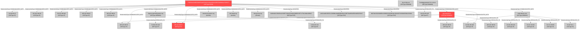

## Investigation Graph Visualization

```mermaid
graph TD;
    %% Node Styling
    classDef malicious fill:#ff4d4d,color:white,stroke:#333;
    classDef suspicious fill:#ffad33,color:white,stroke:#333;
    classDef clean fill:#4dff4d,color:black,stroke:#333;
    classDef unknown fill:#cccccc,color:black,stroke:#333;
    776850a1e6d6915e9bf35aa8355461["776850a1e6d6915e9bf35aa83554616129acd94e3a3f6673bd6ddaec530f4273\n(IOCType.HASH)"]:::malicious;
    44_194_84_13["44.194.84.13\n(IOCType.IP)"]:::unknown;
    151_101_194_49["151.101.194.49\n(IOCType.IP)"]:::unknown;
    89_187_180_102["89.187.180.102\n(IOCType.IP)"]:::unknown;
    185_125_188_62["185.125.188.62\n(IOCType.IP)"]:::unknown;
    185_125_188_61["185.125.188.61\n(IOCType.IP)"]:::unknown;
    185_125_188_54["185.125.188.54\n(IOCType.IP)"]:::unknown;
    185_125_188_57["185.125.188.57\n(IOCType.IP)"]:::malicious;
    34_254_182_186["34.254.182.186\n(IOCType.IP)"]:::unknown;
    ingress_openshift_gnome_org["ingress.openshift.gnome.org\n(IOCType.DOMAIN)"]:::unknown;
    api_snapcraft_io["api.snapcraft.io\n(IOCType.DOMAIN)"]:::malicious;
    motd_ubuntu_com["motd.ubuntu.com\n(IOCType.DOMAIN)"]:::unknown;
    extensions_gnome_org["extensions.gnome.org\n(domain)"]:::unknown;
    cdn_fwupd_org["cdn.fwupd.org\n(domain)"]:::unknown;
    odrs_gnome_org["odrs.gnome.org\n(domain)"]:::unknown;
    44a3bab2c338e3bca24c00f7c3da13["44a3bab2c338e3bca24c00f7c3da1301eb4a5a889f1c667cc781e1bdacd3b9e7\n(IOCType.FILE)"]:::unknown;
    ac941ead01d5451a7a9fd4be4ba9b6["ac941ead01d5451a7a9fd4be4ba9b60b2d3e4138670ae868e655b3b393253227\n(IOCType.FILE)"]:::unknown;
    d997d4c933c09d2ff0cc08380319c8["d997d4c933c09d2ff0cc08380319c84861dec3b3e9637436940356fb1f22626c\n(IOCType.FILE)"]:::unknown;
    54_209_199_109["54.209.199.109\n(IOCType.IP)"]:::unknown;
    3_226_193_133["3.226.193.133\n(IOCType.IP)"]:::unknown;
    185_125_188_58["185.125.188.58\n(IOCType.IP)"]:::unknown;
    185_125_188_59["185.125.188.59\n(IOCType.IP)"]:::unknown;
    34_243_160_129["34.243.160.129\n(IOCType.IP)"]:::unknown;
    54_217_10_153["54.217.10.153\n(IOCType.IP)"]:::unknown;
    54_171_230_55["54.171.230.55\n(IOCType.IP)"]:::unknown;
    54_247_62_1["54.247.62.1\n(IOCType.IP)"]:::unknown;
    frp_v2_ziba_cat["frp.v2.ziba.cat\n(IOCType.DOMAIN)"]:::unknown;
    149_28_169_228["149.28.169.228\n(IOCType.IP)"]:::unknown;
    hundeggersupport_3cx_com_au["hundeggersupport.3cx.com.au\n(IOCType.DOMAIN)"]:::unknown;
    776850a1e6d6915e9bf35aa8355461-->|RelationshipType.COMMUNICATES_WITH|44_194_84_13;
    776850a1e6d6915e9bf35aa8355461-->|RelationshipType.COMMUNICATES_WITH|151_101_194_49;
    776850a1e6d6915e9bf35aa8355461-->|RelationshipType.COMMUNICATES_WITH|89_187_180_102;
    776850a1e6d6915e9bf35aa8355461-->|RelationshipType.COMMUNICATES_WITH|185_125_188_62;
    776850a1e6d6915e9bf35aa8355461-->|RelationshipType.COMMUNICATES_WITH|185_125_188_61;
    776850a1e6d6915e9bf35aa8355461-->|RelationshipType.COMMUNICATES_WITH|185_125_188_54;
    776850a1e6d6915e9bf35aa8355461-->|RelationshipType.COMMUNICATES_WITH|185_125_188_57;
    776850a1e6d6915e9bf35aa8355461-->|RelationshipType.COMMUNICATES_WITH|34_254_182_186;
    776850a1e6d6915e9bf35aa8355461-->|RelationshipType.COMMUNICATES_WITH|ingress_openshift_gnome_org;
    776850a1e6d6915e9bf35aa8355461-->|RelationshipType.COMMUNICATES_WITH|api_snapcraft_io;
    776850a1e6d6915e9bf35aa8355461-->|RelationshipType.COMMUNICATES_WITH|motd_ubuntu_com;
    776850a1e6d6915e9bf35aa8355461-->|RelationshipType.COMMUNICATES_WITH|extensions_gnome_org;
    776850a1e6d6915e9bf35aa8355461-->|RelationshipType.COMMUNICATES_WITH|cdn_fwupd_org;
    776850a1e6d6915e9bf35aa8355461-->|RelationshipType.COMMUNICATES_WITH|odrs_gnome_org;
    776850a1e6d6915e9bf35aa8355461-->|RelationshipType.DROPPED|44a3bab2c338e3bca24c00f7c3da13;
    776850a1e6d6915e9bf35aa8355461-->|RelationshipType.DROPPED|ac941ead01d5451a7a9fd4be4ba9b6;
    776850a1e6d6915e9bf35aa8355461-->|RelationshipType.DROPPED|d997d4c933c09d2ff0cc08380319c8;
    ingress_openshift_gnome_org-->|RelationshipType.RESOLVES_TO|54_209_199_109;
    ingress_openshift_gnome_org-->|RelationshipType.RESOLVES_TO|3_226_193_133;
    api_snapcraft_io-->|RelationshipType.RESOLVES_TO|185_125_188_54;
    api_snapcraft_io-->|RelationshipType.RESOLVES_TO|185_125_188_58;
    api_snapcraft_io-->|RelationshipType.RESOLVES_TO|185_125_188_57;
    api_snapcraft_io-->|RelationshipType.RESOLVES_TO|185_125_188_59;
    motd_ubuntu_com-->|RelationshipType.RESOLVES_TO|34_243_160_129;
    motd_ubuntu_com-->|RelationshipType.RESOLVES_TO|54_217_10_153;
    motd_ubuntu_com-->|RelationshipType.RESOLVES_TO|54_171_230_55;
    motd_ubuntu_com-->|RelationshipType.RESOLVES_TO|54_247_62_1;
    motd_ubuntu_com-->|RelationshipType.RESOLVES_TO|34_254_182_186;
    hundeggersupport_3cx_com_au-->|RelationshipType.RESOLVES_TO|149_28_169_228;

```
