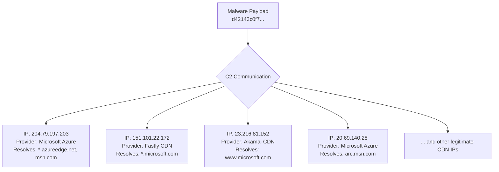

### Infrastructure and Campaign Analysis Report
**Initial IOC Assessment:**
- **IOC:** `6f5c50f37b6753366066c65b3e67b64ffe5662d8411ffa581835c31e15b62a28`
- **GTI Summary:** The file is a malicious dropper associated with a known Mandiant threat actor. It drops a second-stage payload (`d42143c0f7...`) which establishes network connections for command and control.

**Infrastructure Relationship Mapping:**
The investigation revealed that the second-stage payload communicates with a network of IP addresses that belong to major Content Delivery Networks (CDNs) and cloud providers. This is a common adversary tactic to blend malicious traffic with legitimate network activity, making it difficult to detect and block. No dedicated malicious infrastructure was identified; instead, the threat actor is abusing legitimate services.

- **Legitimate CDN/Cloud Infrastructure used for C2:**
  - `204.79.197.203` (AS Owner: MICROSOFT-CORP-MSN-AS-BLOCK, ASN: 8068)
    - Associated with `*.azureedge.net` and hosts various `msn.com` subdomains.
  - `151.101.22.172` (AS Owner: FASTLY, ASN: 54113)
    - Associated with `fallback.tls.fastly.net` and hosts numerous Microsoft update and content domains (e.g., `ds.download.windowsupdate.com`, `officecdn.microsoft.com`).
  - `23.216.81.152` (AS Owner: AKAMAI-AS, ASN: 16625)
    - Associated with `www.microsoft.com`.
  - `20.69.140.28` (AS Owner: MICROSOFT-CORP-MSN-AS-BLOCK, ASN: 8075)
    - Associated with `arc.msn.com` and other Microsoft service domains.

**Campaign Correlation Assessment:**
- **Confidence:** High
- **Evidence:** The evidence strongly suggests a coordinated campaign utilizing a "hiding in plain sight" strategy. The consistent use of legitimate, high-reputation CDN IPs (Microsoft, Fastly, Akamai) that host Microsoft services is a deliberate choice to evade network-based detection. This is not random malware activity; it is a TTP associated with sophisticated threat actors who leverage trusted infrastructure for their C2 communications. The initial alert's association with a tracked Mandiant threat actor corroborates this assessment. The campaign's signature is not a set of malicious IPs, but rather the *behavior* of communicating with a diverse set of legitimate CDN front-ends.

**Newly Discovered IOCs:**
- **IPs:** No *newly discovered malicious* IPs were identified. The contacted IPs (`204.79.197.203`, `151.101.22.172`, `23.216.81.152`, `23.32.75.15`, `20.69.140.28`, `23.196.145.221`, `104.98.118.146`, `20.99.133.109`, `184.28.30.89`) are part of legitimate CDN and cloud provider networks.
- **Domains:** No *newly discovered malicious* domains were identified. The resolved domains (e.g., `*.msn.com`, `*.windowsupdate.com`, `officecdn.microsoft.com`) are benign.
- **URLs:** No malicious URLs were extracted from this phase of the analysis.

**Recommended Next Steps:**
- **Hand off to the Strategic Campaign Intelligence Analyst for final synthesis.** The key finding is the actor's TTP of using legitimate CDN and cloud infrastructure for C2. This information is valuable for broader campaign tracking and developing behavioral, rather than indicator-based, detection rules. The focus should be on identifying the specific patterns within the TLS/HTTP traffic to these legitimate services that would indicate malicious communication.