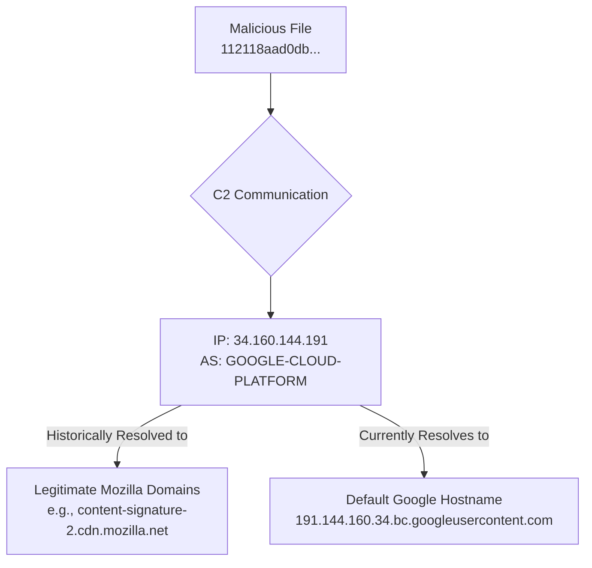

### Infrastructure and Campaign Analysis Report
**Initial IOC Assessment:**
- **IOC:** `34.160.144.191` (Derived from file `112118aad0db9ff6c78dce2e81d9732537ac9cd71412409fa10c7446f71ed8ec`)
- **GTI Summary:** The IP address is hosted on Google Cloud Platform (AS396982). While it has no direct malicious detections, GTI flags it for associations with files that have a high or medium threat level (`has_bad_communicating_files_high`, `has_bad_communicating_files_medium`). This aligns with its role as a C2 server for the analyzed malware.

**Infrastructure Relationship Mapping:**
- The investigation mapped the infrastructure connections starting from the malicious file hash and pivoting to the C2 IP address.
- **`34.160.144.191`** is a Google Cloud IP that acts as the Command and Control server.
- The IP has a history of resolving to numerous legitimate Mozilla-related domains (e.g., `cdn.mozilla.net`, `accounts.firefox.com`), suggesting it is part of a shared cloud environment.
- The IP also resolves to the default Google Cloud hostname `191.144.160.34.bc.googleusercontent.com`. Threat actors often use these default hostnames for C2 to avoid registering and managing custom domains.

**Campaign Correlation Assessment:**
- **Confidence:** Medium
- **Evidence:** The primary evidence of a coordinated campaign comes from the initial malware analysis, which linked the file to a known Mandiant threat actor (MIDIE) and a specific campaign. From an infrastructure perspective, the use of a Google Cloud IP for C2 is a common TTP, but not unique enough on its own to definitively link to a broader campaign without more IOCs. However, the actor's choice to use an IP with a history of legitimate traffic (Mozilla) for C2 activities is a notable defense evasion technique. The malware communicates directly with the IP, and the IP's reverse DNS record is a default Google hostname, a pattern often seen in malicious operations to minimize infrastructure footprint and avoid easy attribution. The lack of other custom, malicious domains resolving to this IP suggests a focused and possibly limited-scope operation or the use of short-lived infrastructure.

**Newly Discovered IOCs:**
- **IPs:**
  - `34.160.144.191` (Confirmed C2)
- **Domains:**
  - `191.144.160.34.bc.googleusercontent.com` (Default hostname used for C2)
- **URLs:**
  - None

**Recommended Next Steps:**
- **Hand off to the Strategic Campaign Intelligence Analyst for final synthesis.** The connection to the MIDIE malware family and a tracked threat actor should be the primary focus for further strategic analysis. The infrastructure findings support the assessment of a targeted operation using common cloud infrastructure for C2 and defense evasion.