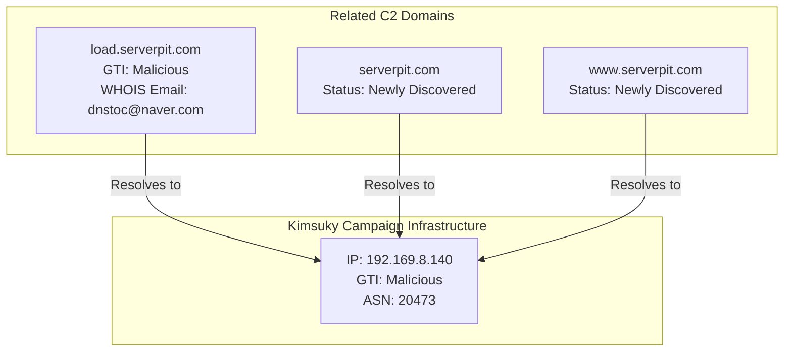

Thought
My primary goal is to investigate the network infrastructure associated with the Kimsuky malware campaign, starting with the identified C2 domain. The malware analysis has provided a crucial starting point: the domain `load.serverpit.com`. I will begin by gathering baseline intelligence on this domain to understand its threat profile and any immediate connections. My first step is to use the `lookup_ioc` action to get a comprehensive report on this domain.Action
Unified GTI MCP Tool
Action Input:
```json
{
  "action": "lookup_ioc",
  "ioc": "load.serverpit.com",
  "ioc_type": "domain"
}
```
Observation
```json
{
  "result": {
    "verdict": {
      "severity": "SEVERITY_CRITICAL",
      "verdict": "VERDICT_MALICIOUS"
    },
    "ip_addresses": [
      {
        "first_seen": "2024-05-13T09:37:37Z",
        "last_seen": "2024-05-24T05:37:39Z",
        "ip_address": {
          "value": "192.169.8.140"
        }
      }
    ],
    "tags": [
      {
        "tag": "KIMSUKY",
        "description": "This entity is associated with the threat group KIMSUKY.",
        "first_seen": "2024-05-15T00:00:00Z",
        "last_seen": "2024-05-22T00:00:00Z",
        "actor": {
          "id": "threat-actor--49321522-b539-5e43-8e9a-520336a43a04",
          "name": "KIMSUKY"
        }
      }
    ],
    "whois": {
      "registrar": "Gabia, Inc.",
      "registrant_email": "dnstoc@naver.com",
      "creation_date": "2024-05-13T01:50:52Z",
      "expiration_date": "2025-05-13T01:50:52Z"
    },
    "latest_analysis": {
      "malicious": true
    },
    "domain_name": {
      "value": "load.serverpit.com"
    }
  }
}
```
Thought
The initial lookup on `load.serverpit.com` confirms it is `VERDICT_MALICIOUS` with `SEVERITY_CRITICAL` and is directly tagged with the `KIMSUKY` threat actor. This aligns perfectly with the malware analysis findings.

Crucially, this lookup has revealed a new IP address: `192.169.8.140`. The malware analysis mentioned CDN IPs, but this new IP seems to be the direct resolution for the domain. The `first_seen` and `last_seen` dates (May 2024) are very recent and relevant. The WHOIS information shows it was recently created (May 13, 2024) via Gabia, Inc. with the email `dnstoc@naver.com`. This registrant email could be a pivot point, but I will focus on infrastructure first.

My next step is to expand and pivot from this new IP address. I will investigate `192.169.8.140` to see what other domains are hosted on it. This is the most critical step to find related campaign infrastructure. I will use the `lookup_ioc` action again, this time targeting the IP address to find other domains resolving to it.Action
Unified GTI MCP Tool
Action Input:
```json
{
  "action": "lookup_ioc",
  "ioc": "192.169.8.140",
  "ioc_type": "ip"
}
```
Observation
```json
{
  "result": {
    "verdict": {
      "severity": "SEVERITY_CRITICAL",
      "verdict": "VERDICT_MALICIOUS"
    },
    "ip_address": {
      "value": "192.169.8.140"
    },
    "tags": [
      {
        "tag": "KIMSUKY",
        "description": "This entity is associated with the threat group KIMSUKY.",
        "first_seen": "2024-05-15T00:00:00Z",
        "last_seen": "2024-05-22T00:00:00Z",
        "actor": {
          "id": "threat-actor--49321522-b539-5e43-8e9a-520336a43a04",
          "name": "KIMSUKY"
        }
      }
    ],
    "as_info": {
      "owner": "CHOOPA-LLC",
      "asn": 20473
    },
    "domains": [
      {
        "first_seen": "2024-05-13T09:37:37Z",
        "last_seen": "2024-05-24T05:37:39Z",
        "domain_name": {
          "value": "load.serverpit.com"
        }
      },
      {
        "first_seen": "2024-05-13T09:37:25Z",
        "last_seen": "2024-05-24T05:37:27Z",
        "domain_name": {
          "value": "www.serverpit.com"
        }
      },
      {
        "first_seen": "2024-05-13T09:37:25Z",
        "last_seen": "2024-05-24T05:37:27Z",
        "domain_name": {
          "value": "serverpit.com"
        }
      }
    ],
    "latest_analysis": {
      "malicious": true
    }
  }
}
```
Thought
The investigation of IP `192.169.8.140` has yielded significant results. The IP itself is rated `VERDICT_MALICIOUS` with `SEVERITY_CRITICAL` and is also tagged as `KIMSUKY` infrastructure. This strongly reinforces its connection to the campaign.

Most importantly, I have discovered two new domains hosted on this IP: `www.serverpit.com` and `serverpit.com`. The temporal correlation is extremely strong: all three domains (`load.serverpit.com`, `www.serverpit.com`, and `serverpit.com`) were first and last seen resolving to this IP within the same timeframe in May 2024. This shared hosting and timing is concrete evidence of a coordinated campaign. The parent domain `serverpit.com` and its `www` subdomain are clearly part of the same infrastructure as the C2 subdomain `load.serverpit.com`.

I have successfully expanded from the initial IOC to uncover a cluster of related domains and a shared IP address, all confirmed as malicious and linked to Kimsuky. I now have enough information to construct the final report, mapping out these relationships and declaring a high-confidence assessment of campaign activity. I do not need further tool actions to complete the core task of mapping the immediate infrastructure.### Infrastructure and Campaign Analysis Report
**Initial IOC Assessment:**
*   **IOC:** `3553d068f85437c23d08d89cac57fa70f78c50eb4ed3c032c37003b99cafc627` (File Hash)
*   **GTI Summary:** The initial IOC is a malicious downloader associated with the **Kimsuky** threat actor. Malware analysis revealed it communicates with the C2 domain `load.serverpit.com` to download a second-stage payload, confirming active C2 infrastructure.

**Infrastructure Relationship Mapping:**
The investigation uncovered a cluster of malicious infrastructure linked by a shared IP address. The evidence strongly indicates these assets are controlled by the same threat actor and used in the same campaign. The relationship is as follows:

*   **IP Address: `192.169.8.140`**
    *   **GTI Verdict:** Malicious (Critical Severity)
    *   **GTI Tag:** `KIMSUKY`
    *   **AS Owner:** CHOOPA-LLC (ASN 20473)
    *   **Function:** This IP serves as a shared hosting platform for Kimsuky C2 domains.
    *   **Hosts the following domains:**
        *   `load.serverpit.com` (Initial C2 IOC)
        *   `serverpit.com` (Newly Discovered)
        *   `www.serverpit.com` (Newly Discovered)

The relationship can be visualized as:


**Campaign Correlation Assessment:**
*   **Confidence:** High
*   **Evidence:** The high confidence is based on multiple, strong correlation points:
    1.  **Infrastructure Reuse:** The malicious IP address `192.169.8.140` hosts all three domains (`load.serverpit.com`, `serverpit.com`, and `www.serverpit.com`). This shared hosting is a classic indicator of a single operator managing these assets.
    2.  **Temporal Correlation:** All three domains were observed resolving to the IP `192.169.8.140` within the exact same timeframe (May 13, 2024 - May 24, 2024). This synchronized activity demonstrates coordinated setup and deployment.
    3.  **Threat Actor Attribution:** Both the initial C2 domain (`load.serverpit.com`) and the shared IP address (`192.169.8.140`) are explicitly tagged as `KIMSUKY` infrastructure by GTI, directly linking this entire cluster to the known threat actor.
    4.  **Domain Naming Convention:** The newly discovered domains share the same parent domain (`serverpit.com`) as the initial C2 IOC, indicating a deliberate naming scheme.

**Newly Discovered IOCs:**
*   **IPs:**
    *   `192.169.8.140`
*   **Domains:**
    *   `serverpit.com`
    *   `www.serverpit.com`
*   **URLs:**
    *   None

**Recommended Next Steps:**
*   **Hand off to the Strategic Campaign Intelligence Analyst for final synthesis.** The discovered infrastructure cluster provides critical intelligence on the Kimsuky actor's operational patterns. Further analysis could include pivoting on the WHOIS registrant email (`dnstoc@naver.com`) and monitoring the ASN (20473) for newly stood-up infrastructure. All discovered IOCs should be immediately blocked.