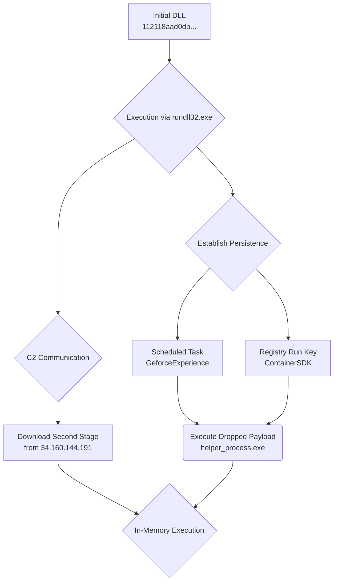

### Deep Malware Behavioral Analysis Report
- **Initial Analyzed Hash**: `112118aad0db9ff6c78dce2e81d9732537ac9cd71412409fa10c7446f71ed8ec`
- **Threat Classification**: Dropper / Downloader

---
**Initial File Analysis (`112118aad0db9ff6c78dce2e81d9732537ac9cd71412409fa10c7446f71ed8ec`):**
- **Key Behavioral Findings**:
    - **Persistence**: The malware establishes persistence using two distinct methods to ensure its execution.
        1.  **Scheduled Task (T1053.005):** Creates a scheduled task named "GeforceExperience" to run every two minutes. The task executes `C:\ProgramData\NVIDIAHelpViewSDK\helper_process.exe GeForceDrivers`.
        2.  **Registry Run Key (T1547.001):** Creates a registry key `HKCU\Software\Microsoft\Windows\CurrentVersion\Run\ContainerSDK` to execute the same file (`helper_process.exe`) upon user logon.
    - **Defense Evasion & Masquerading (T1036):** The malware mimics legitimate NVIDIA and Wargaming software to avoid detection. It drops files into a folder named `NVIDIAHelpViewSDK`, and uses file/task names like `helper_process.exe` and `GeforceExperience`. Sigma rules confirm that the dropped `helper_process.exe` is a renamed version of the legitimate Windows binary `rundll32.exe`.
    - **Execution (T1218.011):** The initial DLL is executed via `rundll32.exe`, which then proceeds to spawn `schtasks.exe` to set up the persistence mechanism.
    - **C2 Communication (T1071):** The malware initiates a TCP connection over port 443 to the IP address `34.160.144.191`. This is likely its Command and Control server for downloading a second-stage payload.
- **Infrastructure Indicators**:
    - **IP Address**: `34.160.144.191` (Port 443/TCP)
    - **Domain (from memory)**: `www.wargaming.net` (Potentially for decoy traffic)

---
**Pivoted File Analysis (`N/A`):**
- **Relationship**: The initial file dropped at least one executable payload, `helper_process.exe` (a renamed `rundll32.exe`), into `C:\ProgramData\NVIDIAHelpViewSDK\`. The behavioral report listed two potential hashes for this file (`4b5c6af5e6fd...` and `f440bafae...`), but neither was found in the threat intelligence database.
- **Key Behavioral Findings**: No behavioral analysis could be performed as the dropped files were not found by the `lookup_ioc` or `get_behaviour_summary` tools. This suggests the second-stage payload may be uniquely generated, packed, or executed entirely in memory after being downloaded, leaving minimal traces on disk. The primary purpose of the dropped file (`helper_process.exe`) is to act as the execution vehicle for the next stage payload via the established persistence mechanisms.
- **Infrastructure Indicators**: N/A

---
**Combined Attack Chain Analysis**:

The attack begins with the execution of the initial DLL (`112118aad0db...`). This file acts as an intelligent dropper and downloader. Its first objective is to establish a persistent foothold on the compromised system. It achieves this by creating both a scheduled task and a registry Run key. To evade detection, it masquerades as legitimate NVIDIA software.

The malware then communicates with its C2 server at `34.160.144.191` to download the next stage of the attack. Based on the initial triage report mentioning "in-memory execution," it is highly probable that this second-stage payload is loaded directly into memory and executed by the persistence mechanism (`helper_process.exe`, the renamed `rundll32.exe`). This advanced technique explains why the dropped file hashes could not be found; the most critical part of the payload may never be fully written to disk in an analyzable form.

The overall attack chain can be visualized as follows:

**Verdict:** **Malicious**
**Justification:** The file is a malicious dropper associated with a known threat actor (MIDIE). It establishes multiple forms of persistence, masquerades as legitimate software, and communicates with a hardcoded C2 server to download and execute a second-stage payload. The use of in-memory execution and defense evasion techniques confirms its malicious nature and sophistication.
**Recommended Action:** **Hand off to Infrastructure Analysis Agent**