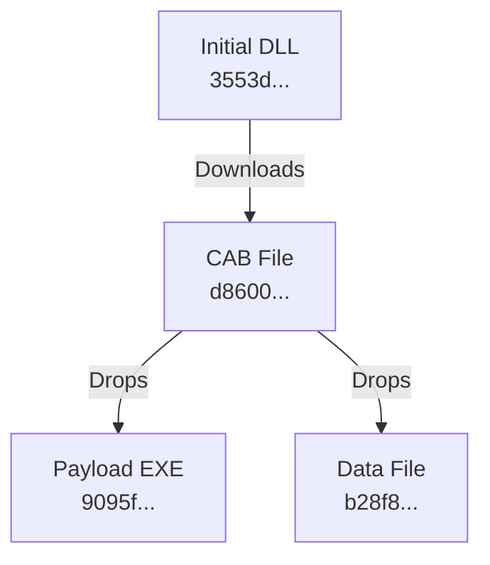

### Deep Malware Behavioral Analysis Report
- **Initial Analyzed Hash**: `3553d068f85437c23d08d89cac57fa70f78c50eb4ed3c032c37003b99cafc627`
- **Threat Classification**: Downloader / Dropper

---
**Initial File Analysis (`3553d068f85437c23d08d89cac57fa70f78c50eb4ed3c032c37003b99cafc627`):**
- **Key Behavioral Findings**:
    - The initial malware, a 64-bit DLL, is executed, likely via `regsvr32.exe`.
    - It initiates an HTTP GET request to a hardcoded Command and Control (C2) server to download the next stage payload.
    - The malware downloads a `.cab` file and saves it to the user's internet cache (`C:\Users\admin\AppData\Local\Microsoft\Windows\INetCache\IE\L49V4L9G\setup[1].cab`).
    - The behavioral tags include `PERSISTENCE`, `OBFUSCATED`, `DETECT_DEBUG_ENVIRONMENT`, and `LONG_SLEEPS`, indicating advanced evasion techniques.
- **Infrastructure Indicators**:
    - **Domain**: `load.serverpit.com`
    - **URL**: `http://load.serverpit.com/themes/default/images/menu/first/free/down.php?id=zadmin&size=01`
    - **Resolved IPs**: `52.123.128.14`, `52.123.129.14` (for `s-0005.dual-s-msedge.net`, likely a CDN or proxy)

---
**Pivoted File Analysis (`d8600c73248316e6a14766863c63955682121e7d962059371e72e81179044a8c`):**
- **Relationship**: Dropped by the initial file (`3553d...`) after being downloaded from the C2 server.
- **Key Behavioral Findings**:
    - This file is a Cabinet archive (`.cab`) that acts as a second-stage dropper.
    - It drops two files into the `C:\ProgramData\Apple\` directory, likely to masquerade as a legitimate Apple component.
        - **Executable Payload**: A 61KB executable file is dropped at `C:\ProgramData\Apple\Sync\setup.exe` (SHA256: `9095f7599c27b3b3d4a3666b610c1f543666f44d5cf3ace725c50c2662243d52`). This is the final payload.
        - **Data File**: A 1KB data file is dropped at `C:\ProgramData\Apple\DRM\key.dat` (SHA256: `b28f8042451f2162649f86022e336d3753574c82b994d5098f980e14c405a898`). This could be a configuration file, victim identifier, or encryption key for the main payload.
- **Infrastructure Indicators**:
    - None directly observed from this file's execution, as its primary purpose is to drop the embedded payload.

---
**Combined Attack Chain Analysis**:
The attack follows a multi-stage infection chain characteristic of the Kimsuky threat actor.
1.  **Stage 1 (Downloader)**: The initial DLL (`3553d...`) acts as a downloader. It connects to the C2 domain `load.serverpit.com` to fetch the second stage.
2.  **Stage 2 (Dropper)**: The downloaded `.cab` file (`d8600...`) is a dropper that extracts and places the final payload and a configuration/data file onto the disk in a directory masquerading as a legitimate software folder.
3.  **Stage 3 (Payload)**: The dropped executable `setup.exe` (`9095f...`) is the ultimate payload, which likely performs the primary malicious actions such as data theft, espionage, or establishing a persistent backdoor.

The relationship can be visualized as:

**Verdict:** **Malicious**
**Justification:** The analysis confirms a multi-stage malware infection. The initial file, linked to the Kimsuky APT group, downloads a second-stage dropper which in turn installs a final payload executable. This chain of behavior, from C2 communication to payload deployment using masquerading techniques, is unequivocally malicious and designed to compromise the target system.
**Recommended Action:** **Hand off to Infrastructure Analysis Agent**